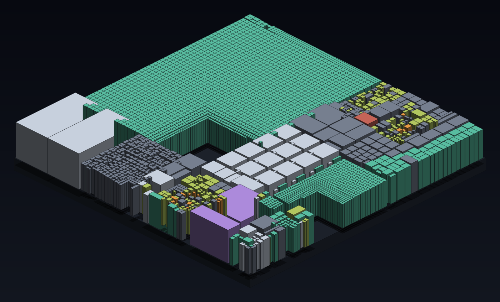

# SECTOR

> A fast, keyboard-friendly **file explorer for Windows** — with a 2.5D cityscape
> view of your disk built in.



SECTOR is a native Windows file explorer that treats **local disks and mapped
NAS/SMB shares as equals**. It's a normal two-pane explorer first — folder tree,
file list, the usual operations — and a **visualizer second**: flip any folder
into an interactive isometric "cityscape" to see at a glance where your space
went.

## Files view (the explorer)

- **Folder tree + file list**, fully keyboard-drivable. **Tab** switches panes;
  arrows move; **→/←** open/close tree folders; type letters to **jump**
  (type-ahead) in either pane. `Ctrl+↑/↓` moves the cursor without selecting
  and `Ctrl+Space` toggles it, so non-contiguous selections work by keyboard.
  `Shift+F10` opens the context menu; `Esc` clears the filter, then the
  selection, then closes Details. With the tree focused, `F2` / `Del` /
  `Ctrl+C` / `Ctrl+X` / `Alt+Enter` act on the folder you're in, and `Enter`
  expands or collapses it. Drag the divider to resize the tree, or
  **double-click it** to fit the widest visible row.
- **Navigation** — a clickable breadcrumb (or `Alt+D` / `Ctrl+L` / `F4` to type
  a path), plus **Back/Forward/Up** (`Alt+←` / `Alt+→` / `Backspace` or `Alt+↑`)
  with history.
- **List** — Name / Size / Type / Modified, sortable, virtualized for huge
  folders, file-type–colored. Folder sizes appear when a scan covers the folder.
- **Filter** the current folder as you type (`Ctrl+F`), and a **hidden-files** toggle.
- **Details** panel (`Alt+Enter`, or the toolbar toggle) — path, sizes, dates,
  attributes.
- **Multi-select** — click / `Ctrl`-click / `Shift`-click / `Ctrl+A`.

### File operations

- Open (`Enter` / double-click; on a multi-selection, every selected file),
  **Reveal in Explorer**, **Copy path** (`Ctrl+Shift+C`) **/ name**.
- **New folder** (`Ctrl+Shift+N`) and **Rename** (`F2`) — validated (bad chars,
  reserved names, duplicates), extension preserved on rename.
- **Cut / Copy / Paste** (`Ctrl+X/C/V`) — shares the **Windows clipboard** with
  Explorer, so files copied or cut there paste here and vice versa. Runs in the
  background, **never overwrites** (auto-renames to "… - Copy"), a cut source is
  removed only after its copy succeeds, cross-volume moves fall back to
  copy-then-delete.
- **Delete** (`Del`) → the **Recycle Bin** on local drives, with a confirmation.
  Network drives have no Windows Recycle Bin, so those delete for real (and are
  caught by your NAS's own recycle bin, e.g. Synology's `#recycle`, if enabled) —
  the dialog says so.
- **Undo** (`Ctrl+Z`, or the footer button) — reverses the last rename, new
  folder, paste (copy or move, even a partial one), or delete (restored from the
  Recycle Bin). Never overwrites: an undo that would collide stops and says so.
- **Refresh** with `F5` / `Ctrl+R`.

## City view (the visualizer)

Flip to **City** to render the current folder as a 2.5D isometric cityscape:

- **Area = size** · **Height = file count** · **Color = file type**
- **Live discovery build** — the map rises as it scans, not a blank spinner.
- **Instant reopen** — each scan is cached compactly, so reopening an 82 TB drive
  takes ~1 second instead of minutes.
- **Freshness (local NTFS)** — the USN change journal tells you whether a cached
  view is still current, so you know when to rescan.

## Build & run

Windows, with the Rust MSVC toolchain:

```
cargo run -p sector-app
```

The core, layout, and file-op logic are OS-agnostic and unit-tested; only the GUI
and the Windows-specific paths (USN, drive/network detection, Recycle Bin) require
Windows.

## Layout

| Crate | Role |
|---|---|
| `crates/sector-core` | Data model (arena tree), squarified treemap layout, file-type classification, cache serialization |
| `crates/sector-scan` | Concurrent filesystem scanner, single-directory listing, NTFS USN freshness |
| `crates/sector-app`  | The egui / wgpu GUI (explorer + cityscape) |

## Docs

- [`docs/ROADMAP.md`](docs/ROADMAP.md) — build plan and progress
- [`docs/DECISIONS.md`](docs/DECISIONS.md) — design decisions (D1–D19)
- [`docs/README.md`](docs/README.md) — goals & non-goals

## Status

Active development. **Windows-only by design** — it leans on Windows filesystem
specifics (MFT/USN, the shell) rather than a lowest-common-denominator portable
approach. **No AI/assistant integration** — a firm, permanent non-goal.

---

Built with [Claude Code](https://claude.com/claude-code).
